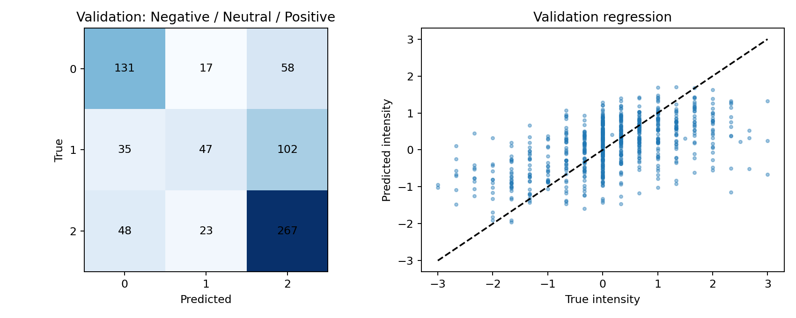

# Accuracy选模与BERT-Tiny微调实验

本轮只使用官方训练集拟合，在此前已使用的官方验证集选择类别权重、学习率、训练轮次与候选模型。未重新评价官方测试集；验证分数是选模结果，不是新的独立泛化证据。

目标：完整输入三分类Accuracy≥0.70。选定模型：neural；验证Accuracy=0.6113；未达到本轮验证目标。

## 同条件验证对照

| 模型 | 完整Accuracy | Macro-F1 | MAE | Pearson | 中性召回率 | 31个缺失情景平均Accuracy |
|---|---:|---:|---:|---:|---:|---:|
| original | 0.5783 | 0.5559 | 0.6623 | 0.5437 | 0.4130 | 0.5682 |
| linear | 0.6003 | 0.5581 | 0.6627 | 0.5426 | 0.3152 | 0.5845 |
| neural | 0.6113 | 0.5562 | 0.6679 | 0.5518 | 0.2554 | 0.5913 |

## 类别权重与Accuracy选模

线性对照保持原特征映射、连续缺失增强、回归分支及融合配置，只改变类别权重与分类C。gamma=0为等权，0.5为温和逆频率，1为balanced；训练样本平均权重归一至1。

| gamma | C | Accuracy | Macro-F1 | 中性召回率 |
|---|---:|---:|---:|---:|
| 0.0 | 0.5 | 0.5879 | 0.5146 | 0.1793 |
| 0.0 | 2.0 | 0.5824 | 0.5192 | 0.2120 |
| 0.0 | 8.0 | 0.5810 | 0.5335 | 0.2826 |
| 0.5 | 0.5 | 0.6003 | 0.5581 | 0.3152 |
| 0.5 | 2.0 | 0.5824 | 0.5391 | 0.2935 |
| 0.5 | 8.0 | 0.5783 | 0.5406 | 0.3207 |
| 1.0 | 0.5 | 0.5769 | 0.5551 | 0.4239 |
| 1.0 | 2.0 | 0.5810 | 0.5582 | 0.4185 |
| 1.0 | 8.0 | 0.5783 | 0.5466 | 0.3533 |

## 同结构冻结与微调对照

BERT可见位置均值池化，经LayerNorm后与训练集标准化的音视频统计融合，接三分类与强度回归头。损失为类别加权交叉熵+0.2×SmoothL1。每轮每条原始样本取一个版本，完整输入概率0.6，其余在三份固定局部缺失版本中等概率选择。冻结与微调使用相同结构、初始化种子、视图选择和头部学习率；编码器冻结时保持eval状态。与线性模型相比也改变了预测头、训练目标和采样方式，不能把全部差异归因于微调。

| 编码器 | gamma | 编码器学习率 | 最佳轮次 | Accuracy | Macro-F1 | MAE |
|---|---:|---:|---:|---:|---:|---:|
| 冻结 | 0.0 | 0.0 | 9 | 0.5920 | 0.5231 | 0.6973 |
| 冻结 | 0.5 | 0.0 | 7 | 0.5865 | 0.5350 | 0.7000 |
| 冻结 | 1.0 | 0.0 | 7 | 0.5508 | 0.5308 | 0.7007 |
| 微调 | 0.0 | 2e-05 | 9 | 0.6058 | 0.5491 | 0.6721 |
| 微调 | 0.0 | 5e-05 | 6 | 0.6113 | 0.5562 | 0.6679 |
| 微调 | 0.5 | 2e-05 | 10 | 0.5989 | 0.5580 | 0.6756 |
| 微调 | 0.5 | 5e-05 | 6 | 0.6016 | 0.5776 | 0.6696 |
| 微调 | 1.0 | 2e-05 | 12 | 0.5893 | 0.5715 | 0.6736 |
| 微调 | 1.0 | 5e-05 | 8 | 0.5824 | 0.5579 | 0.6761 |

## 验证错误分析与不确定性

选定模型相对旧集成Accuracy差值为+0.0330，按video_id分组500次成对bootstrap的95%描述性区间为[+0.0014, +0.0652]。区间未计入候选及轮次选择的不确定性，不应解读为无偏的确认性显著性检验。

| 类别 | 样本数 | 召回率 | 强度MAE |
|---|---:|---:|---:|
| 0 | 206 | 0.6359 | 0.7952 |
| 1 | 184 | 0.2554 | 0.4715 |
| 2 | 338 | 0.7899 | 0.6973 |

完整逐样本错误表见validation_errors.csv。分类与回归仍独立输出，不强行将中性强度置零；混淆与残差用于定位问题，不能单独证明其语言或行为原因。缺失评估覆盖30%下7种模态组合×4个位置，外加全模态随机10%、50%、70%，不等于全因子穷举或真实秒数分析。

## 交付与限制

附件3_Accuracy候选预测.csv包含对齐版本30条无标签预测，不据此计算Accuracy。旧outputs/formal和outputs/refinement_v2保持不变。选模以完整Accuracy优先，可能牺牲Macro-F1、MAE或缺失鲁棒性，不能将分类胜出自动视为问题2综合最优。只运行一个训练种子，本轮不提供跨种子稳定性结论。运行说明见ACCURACY_README.md。
