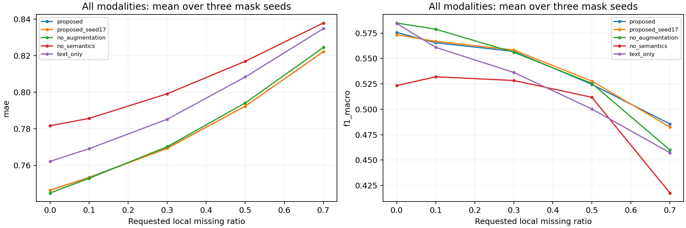
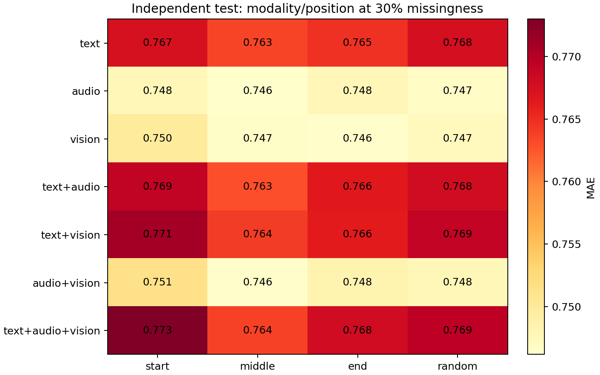
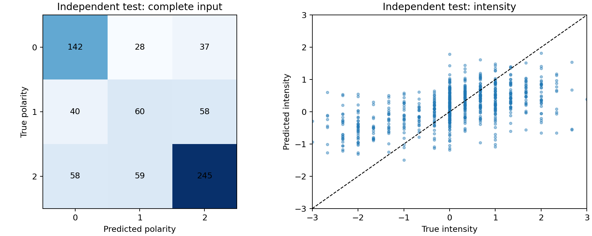

# 问题 2 模态局部缺失条件下的鲁棒情感预测

## 摘要

针对文本、语音和视觉中连续局部片段不可用的情形，建立由观测掩码、预训练语义与词元词组特征、音视频时序统计、可用比例加权融合和正则化双任务预测组成的模型。使用赛题附件 2 的全部 3395 条训练样本拟合模型，在 728 条验证样本上选择参数；选择结果及文件哈希冻结后，对 727 条官方测试样本进行独立评价，并完成附件 3 对齐版全部 30 条样本的预测。

完整测试输入下，三种子集成模型 Accuracy 为 0.6149，Macro-F1 为 0.5756，MAE 为 0.7464，Pearson 为 0.5476。训练集多数类及强度中位数构成的常数参考分别得到 Accuracy=0.4979、Macro-F1=0.2216、MAE=0.8849。后续讨论以实际实验表格和不确定性区间为依据，不将模型设计本身视作有效性的证明。

## 1 问题分析与输入约束

问题 2 要同时给出三分类情感极性和 [-3,3] 内的情感强度，并分析缺失模态类型、位置和持续长度的影响。这里的“局部缺失”以连续序列区间表示，不以整模态移除代替主要实验。

采用 aligned_50.pkl，文本、音频、视觉的序列位置均为 50，音频和视觉维度为 74、35。附件 3 对齐版提供 text_bert、audio、vision，未提供连续 text 向量。因此训练与专项预测统一使用 text_bert 所携带的词元编号，而不在推理时临时更换文本特征空间。非对齐版的 vision_lengths 与非零范围不一致，且专项长度元数据不足，本解答不采用该版本。

对齐版共有训练 3395、验证 728、测试 727 条样本。数据审计未发现跨划分重复 sample_id 或 video_id。分类标签已核实为 0=负向、1=中性、2=正向，并与连续标签的符号一一对应。强度恰为 0 时属于中性。样本和标签均未删除或修改。

预训练语义模型选用 Google BERT Miniatures 中的 L=2、H=128、A=2 模型，固定版本 `30b0a37ccaaa32f332884b96992754e246e48c5f`。用其 uncased WordPiece 词表对训练和验证原始文本重新分词，3395/3395 与 728/728 条词元序列均完全匹配赛题 text_bert；核验记录见 tokenizer_verification.json。编码器使用通用预训练权重，不引入其他情感数据集训练或选参。其参数在本方案中冻结，监督参数全部由赛题训练集学习。

## 2 假设、符号与数据预处理

设样本 i 的三模态序列为 $X_i^m$，$m \in \{t,a,v\}$；情感类别为 $c_i$，强度为 $y_i$。定义：

| 符号 | 定义 |
|---|---|
| $V_{it}$ | 人工增强前保存的候选有效范围 |
| $A_{it}^m$ | 原始可用位置，独立于后续增强 |
| $D_{it}^m$ | 人工连续缺失位置 |
| $O_{it}^m=A_{it}^m(1-D_{it}^m)$ | 当前观测掩码 |
| $q_i^m$ | 当前可用位置数与候选有效位置数之比 |
| $\rho$ | 名义遮蔽比例，实际值另行记录 |

文本 attention 为前缀连续掩码。现有全部 aligned 样本的音视频非零位置未超出其范围，因此使用原始 attention 作为共同候选范围。此规则是数据检查支持的建模假设，不等同于证明每一序列位置对应精确的物理时间。文本编码器保留 [CLS]/[SEP]，文本词组提取与语义池化排除已核验的 101、102；编号 100 是 [UNK]，不直接当作缺失。

音视频全零行在有效范围内暂按不可用处理，但不将其原因一概归为人为损坏：可能包含无效提取或特殊位置。对所有样本保留独立的有效、可用和人工缺失掩码。全模态无可用信息时，各输入分支返回有限的零表示，而不删除样本。

附件没有逐词真实时间戳，所以本文所有长度均以“连续序列位置数”和“占有效位置的比例”表示，不能直接换算为秒。此限制同时适用于位置规律的解释。

## 3 连续缺失机制

对选中的模态，构造半开区间 $[s,s+\ell)$，在区间中令 $D^m=1$，其中名义预算为

$$\ell_0=\lfloor \rho\sum_t V_{it}\rfloor.$$

区间不能进入填充范围，并尽量保留至少一个原先可用的位置；文本区间还不得遮蔽被排除的特殊词元。约束无法同时满足名义长度时缩短区间，记录实际遮蔽比例以及未达到名义值的情况。小比例因整数取整可能不产生遮蔽。

同一样本、模态、位置和种子下，随 $\rho$ 增大的区间保持嵌套，减少比例实验中位置随机变化的干扰。首、中、尾按相应锚点选区间，随机位置由固定种子确定。不同模态独立生成区间，不把“同一序列坐标”解释为已验证的真实秒数同步。

训练时保留原样本，并为每条样本生成三个增强版本，对应 10%、30%、50% 的预算，每个版本随机选择非空模态组合及位置。四个版本各赋 1/4 样本权重，使一条原始样本总权重不因复制而增加。训练增强种子为 17、41、83，分别拟合三个模型，最终平均预测。70% 缺失仅用于更强压力测试，不参与训练增强。

## 4 特征构造与融合

### 4.1 词元词组特征

从当前可见词元中构造 unigram 和相邻 bigram。只在原序列中两个位置相邻且都可用时生成 bigram，因此不会跨缺失区间连接词元。词表仅由未增强训练输入拟合，最低文档频率为 2，最大词表容量为 12000；验证与测试不参与词表或 IDF 学习。

采用平滑 IDF 和对数词频：

$$\operatorname{idf}(w)=\log\frac{1+N}{1+\operatorname{df}(w)}+1,\qquad \operatorname{tf}(w)=1+\log n_w,$$

随后进行 L2 归一化，得到稀疏词组向量 $\boldsymbol l_i$。编号作为稳定词元标识使用，不要求恢复完整原文。

### 4.2 预训练语义特征

在进入 BERT 前，将人工缺失词元的编号、attention 和 segment 输入屏蔽，再进行上下文编码。按当前文本池化掩码聚合，得到 128 维语义向量 $\boldsymbol s_i$。若先编码完整文本再删除部分缓存向量，其他位置可能已包含被删除词元的信息，因此本方案不采用这种处理。

语义标准化统计量只来自完整训练输入，变换后 L2 归一化。完全无可池化文本时置零。语义缓存键包含实际可见编号、attention、segment 和池化掩码，不包含标签，也不按 sample_id 回填完整文本。

### 4.3 音视频时序统计

对每个特征维度提取可用位置的均值、标准差、前/中/后三段均值，以及原序列中相邻且都可用位置的平均绝对变化。音频和视觉分别得到 $6\times74=444$ 与 $6\times35=210$ 维表示。

每个统计量携带有效性标记。例如某一时间段完全不可用时，其均值不可当作一个观测到的零值参与标准化。各维均值与方差仅从训练集中该统计量有效的样本估计；变换后无效统计量保持零，常数维度缩放系数取 1。标准化结果截断到 [-5,5]，并除以维度数平方根，减少模态维数和异常值的影响。这是预先固定的处理规则，并未使用测试结果调整。

### 4.4 可用比例加权融合

记音视频标准化表示为 $\boldsymbol a_i,\boldsymbol v_i$，定义 $g(q)=\sqrt q$，构造

$$\boldsymbol\phi_i=[g(q_i^t)\boldsymbol l_i;g(q_i^t)\boldsymbol s_i;\eta g(q_i^a)\boldsymbol a_i;\eta g(q_i^v)\boldsymbol v_i;0.1\boldsymbol q_i].$$

该比例权重是输入可用程度的先验处理，不是已证明的置信概率，也不作为因果解释。各分支的预测贡献仍由监督学习得到的系数决定。设置去掉比例缩放及显式比例特征的消融模型，检验其实际价值。

## 5 双任务目标与求解

分类使用带 L2 正则的多项逻辑回归，$\boldsymbol p_i=\operatorname{softmax}(W\boldsymbol\phi_i+\boldsymbol b)$，取最大概率类别作为极性。类别权重由训练集频率计算，使用 balanced 形式；验证和测试标签不参与权重估计。

分类求解加权交叉熵及参数惩罚，正则强度通过 C 控制；训练中检查优化收敛，不能把未收敛拟合作为已完成结果。回归使用岭回归：

$$\min_{\boldsymbol\beta,b}\sum_i w_i(y_i-\boldsymbol\beta^\top\boldsymbol\phi_i-b)^2+\alpha\|\boldsymbol\beta\|_2^2.$$

预测强度截断到 [-3,3]。截断只发生在输出阶段，不改变训练标签。分类和回归分别优化，可能出现极性与预测强度符号不一致；本文保留两者并在错误表中标记，不在测试后临时调阈值消除矛盾。

三个增强种子得到的类别概率和强度分别求均值，形成主模型。各消融只用种子 17 并共用已选超参数，应与 proposed_seed17 比较以避免把集成收益误当作消融收益。

## 6 实验协议与参数选择

训练全部 3395 条样本；验证全部 728 条样本。所有数据衍生参数、词表、标准化和预测参数只在训练集拟合。验证集选择 C、alpha 和音视频缩放 eta。

搜索范围为 C∈{0.5,2,8}、alpha∈{1,10,100}、eta∈{0.1,0.3}，共 18 组组合。模型结构、搜索范围、增强种子、测试情景和汇总方法事先写入 formal_protocol.json。

选择评分为验证集完整输入、文本/语音/视觉各自 30% 随机缺失、三模态 30% 和 50% 随机缺失这六个情景中 $MAE+(1-MacroF1)$ 的均值。该评分是兼顾两个任务的预设权衡，不是赛题官方综合分。最终选定 C=0.5、alpha=10.0、eta=0.3，验证选择评分为 1.1185。

选择后保存 frozen_selection.json，记录参数、训练/验证 ID、模型与特征文件哈希。之后进入独立测试阶段，代码不再拟合或选参。测试结果不用于切换主模型、修改预处理或重选阈值。

独立测试包含完整输入与 7 种模态组合、4 个比例（10%、30%、50%、70%）、4 类位置。首中尾各用一个确定性情景，随机位置使用三个种子，总计 169 个情景。各模型复用相同输入和缺失区间。条件均值先对同一随机情景的三个种子取平均，再对模态×比例×位置的 112 个条件等权汇总，避免随机位置因重复次数多而被过度加权。

## 7 独立测试结果

下表完整输入的四类指标与跨缺失条件汇总均来自冻结后的官方测试划分。Pearson 对常数参考无定义，不能写作零。

| 模型 | Accuracy | Macro-F1 | MAE | Pearson | 缺失条件平均 MAE | 缺失条件平均 Macro-F1 |
|---|---:|---:|---:|---:|---:|---:|
| 三种子集成主模型 | 0.6149 | 0.5756 | 0.7464 | 0.5476 | 0.7666 | 0.5554 |
| 去掉缺失增强 | 0.6217 | 0.5849 | 0.7449 | 0.5505 | 0.7665 | 0.5565 |
| 去掉可用比例处理 | 0.6149 | 0.5727 | 0.7458 | 0.5483 | 0.7629 | 0.5520 |
| 去掉预训练语义 | 0.5805 | 0.5233 | 0.7817 | 0.4899 | 0.7971 | 0.5186 |
| 仅文本 | 0.6162 | 0.5845 | 0.7622 | 0.5199 | 0.7822 | 0.5478 |
| 仅音视频 | 0.5007 | 0.4563 | 0.8405 | 0.3161 | 0.8445 | 0.4428 |
| 主模型 单种子17 | 0.6121 | 0.5734 | 0.7464 | 0.5472 | 0.7667 | 0.5543 |

### 7.1 缺失比例影响

三模态均出现随机局部连续缺失时，按三个缺失种子平均：

| 名义缺失比例 | Accuracy | Macro-F1 | MAE | MAE 的掩码种子标准差 |
|---|---:|---:|---:|---:|
| 10% | 0.6043 | 0.5655 | 0.7534 | 0.0048 |
| 30% | 0.5906 | 0.5570 | 0.7695 | 0.0018 |
| 50% | 0.5456 | 0.5245 | 0.7924 | 0.0024 |
| 70% | 0.4998 | 0.4855 | 0.8223 | 0.0072 |

名义比例与真实遮蔽位置数存在整数取整和可用性约束造成的偏差，应结合 test_masks.jsonl.gz 的 actual_rates 解读。曲线不被预先强制为单调；个别遮蔽可能删除噪声，有限样本也会造成波动。

### 7.2 缺失类型和位置影响

30% 随机缺失的不同模态组合：

| 缺失模态 | Accuracy | Macro-F1 | MAE |
|---|---:|---:|---:|
| audio | 0.6167 | 0.5788 | 0.7466 |
| audio+vision | 0.6107 | 0.5736 | 0.7477 |
| text | 0.5983 | 0.5638 | 0.7676 |
| text+audio | 0.5965 | 0.5624 | 0.7680 |
| text+audio+vision | 0.5906 | 0.5570 | 0.7695 |
| text+vision | 0.5933 | 0.5588 | 0.7691 |
| vision | 0.6089 | 0.5712 | 0.7472 |

在这组限定条件下，最高 MAE 对应 text+audio+vision（0.7695），最低对应 audio（0.7466）。这只描述本模型、本数据和指定比例下的观测结果，不能推断某模态在所有场景中恒定更重要。

位置热图 test_position_heatmap.png 与完整 condition_summary.csv 给出首、中、尾、随机位置差异。因缺少真实时间戳，位置是对齐序列坐标的位置，不是视频开头或结尾多少秒的精确标定。

### 7.3 消融与不确定性

在统一超参数和单种子条件下，加入缺失增强使缺失条件平均 MAE 相比无增强模型增加 0.0001。其他消融结果必须连同分类和回归两类指标阅读；某模块若只改善其中一项，不能声称全面优于对照。

采用按 video_id 分组的成对 bootstrap，重复 500 次，以保留同一原始视频多个片段之间的相关性。区间反映测试视频采样的不确定性，不包含所有超参数搜索或预训练模型选择的不确定性；也未对大量条件比较做多重检验校正。

| 情景 | 统计量 | 95% bootstrap 区间 |
|---|---|---|
| complete | proposed_accuracy | [0.5745, 0.6532] |
| complete | proposed_macro_f1 | [0.5343, 0.6160] |
| complete | proposed_mae | [0.6974, 0.8021] |
| complete | augmentation_delta_macro_f1 | [-0.0249, 0.0049] |
| complete | augmentation_delta_mae | [-0.0014, 0.0044] |
| 211 / random / text+audio+vision / 0.3 | proposed_accuracy | [0.5516, 0.6275] |
| 211 / random / text+audio+vision / 0.3 | proposed_macro_f1 | [0.5156, 0.5971] |
| 211 / random / text+audio+vision / 0.3 | proposed_mae | [0.7119, 0.8237] |
| 211 / random / text+audio+vision / 0.3 | augmentation_delta_macro_f1 | [-0.0174, 0.0120] |
| 211 / random / text+audio+vision / 0.3 | augmentation_delta_mae | [-0.0035, 0.0021] |

augmentation_delta 为单种子主模型减无增强模型；Macro-F1 差值为正、MAE 差值为负才表示相应指标改善。若区间跨越 0，应表述为证据不足，而不是显著有效。training_seed_variation.json 另外记录三个训练增强种子在固定验证情景下的变化；随机种子重复不能替代独立样本检验。

## 8 错误分析与专项预测

混淆矩阵和强度散点图位于 test_diagnostics.png。test_error_by_class.csv 给出三类样本的误差，test_error_cases.csv 列出强度绝对误差最大的 30 条样本及分类/回归不一致标记。这些用于定位中性判断、强情感幅度低估等可能问题，具体归因需要结合样本核查，不能单凭残差认定原因。

附件 3 的 30 条 aligned 样本全部经相同的词元处理、预训练编码器、训练集拟合的特征映射和冻结集成模型预测，结果保存在 `附件3_问题2_预测结果.csv`。没有标签，因而不计算专项准确率。没有从附件 2 按 ID 检索完整文本或完整模态去补回专项缺失。

结果列为 sample_id、source_file、polarity、intensity 和三类概率。source_file 原样保留赛题文件名，sample_id 为文件名加文件内索引。题目没有给出更细的 CSV 列名及原始 ID 映射，因此这一映射写入说明；如后续公布模板，只需替换导出层，不改变模型预测。

## 9 可复现性、局限与后续替换

实现划分为输入适配、缺失生成、语义编码、稀疏文本特征、时序统计与掩码标准化、融合、双任务优化、集成、评价与导出。模型与特征映射序列化保存，预训练模型修订号和 SHA256 另有记录。语义编码器可替换为已核验词表的其他本地模型；替换后必须重拟合特征标准化和监督模型，不能沿用旧特征空间的系数。

主要局限包括：共同有效范围及全零行的解释仍是显式假设；音视频统计未完整保留高阶动态关系；冻结的小型 BERT 能力有限；人工缺失机制不必然完全覆盖专项真实机制；分类与回归没有硬性一致约束；结果只对本次数据划分和实验协议负责。本文未将上述未定事项伪装成已验证事实。

复现命令、依赖版本、模块接口和预测脚本见 FORMAL_README.md。正式提交包同时遵守不包含原始大数据、控制在 50 MB 内和不加入参赛身份信息的要求；完整审计及所有逐样本实验日志保留在本地。

## 参考资料

1. Zadeh et al. Multimodal Language Analysis in the Wild: CMU-MOSEI Dataset and Interpretable Dynamic Fusion Graph. ACL 2018. https://aclanthology.org/P18-1208/
2. Turc et al. Well-Read Students Learn Better: On the Importance of Pre-training Compact Models. 2019. https://arxiv.org/abs/1908.08962
3. Google BERT Miniatures 模型说明与权重。https://huggingface.co/google/bert_uncased_L-2_H-128_A-2
4. Neverova et al. ModDrop: Adaptive Multi-Modal Gesture Recognition. https://arxiv.org/abs/1501.00102 。本文借鉴缺失增强思想，使用的是连续局部区间，而非直接复现其整通道训练方法。
5. scikit-learn 官方 TF-IDF 与线性模型文档。https://scikit-learn.org/stable/modules/generated/sklearn.feature_extraction.text.TfidfVectorizer.html

本解答的方法、选择评分和实验结论以本地记录为依据，未使用外部论文成绩替代本题实测结果。
