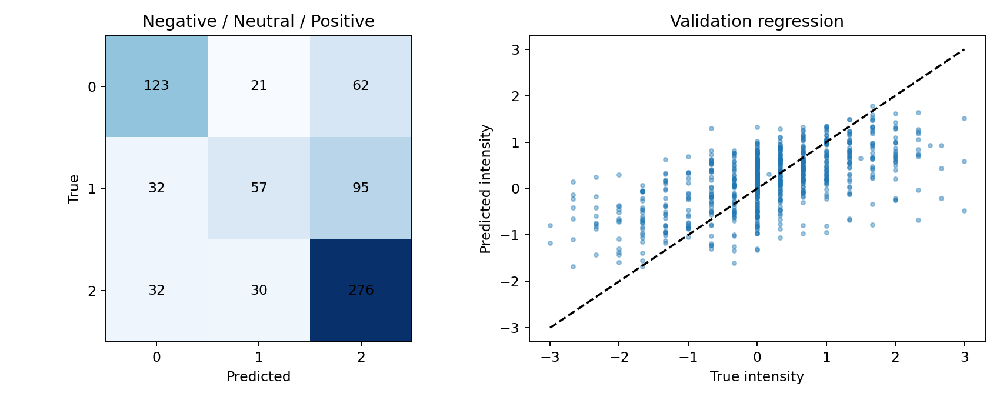

# BERT-Mini 时序编码与门控融合实验

最终候选：mini_mag。完整输入验证Accuracy=0.6264；未达到0.70验证目标。

所有模型仅使用官方train的3395条样本训练，728条valid选择轮次和结构；官方test未评价。验证集此前已反复使用，本轮分数不是新的独立泛化证据。每种新结构固定两个种子，均纳入概率与强度平均，不按种子表现挑选成员。

## 同条件验证结果

| 模型 | 完整Accuracy | Macro-F1 | MAE | Pearson | 中性召回率 | 31个缺失场景平均Accuracy |
|---|---:|---:|---:|---:|---:|---:|
| accuracy_v3 | 0.6113 | 0.5562 | 0.6679 | 0.5518 | 0.2554 | 0.5913 |
| tiny_text | 0.5975 | 0.5311 | 0.6682 | 0.5489 | 0.1957 | 0.5844 |
| mini_text | 0.6250 | 0.5687 | 0.6455 | 0.5841 | 0.2663 | 0.6054 |
| mini_temporal | 0.6168 | 0.5513 | 0.6352 | 0.6067 | 0.2228 | 0.6030 |
| mini_mag | 0.6264 | 0.5774 | 0.6386 | 0.5971 | 0.3098 | 0.6079 |

## 结构和公平对照

tiny_text与mini_text比较两层128维Tiny和四层256维Mini，均只使用文本。mini_temporal在Mini上加入音视频各两层掩码时序卷积，隐维32、卷积核3；mini_mag在相同结构上加入MAG启发的逐位置门控残差，残差范数上限为文本表示范数的0.1倍。门控在BERT输出后作用，不是原论文在BERT内部插入模块的原样复现。

时序编码保留原50个位置，通过独立观测掩码逐层清零无效位置；不压缩缺失间隙。音视频池化不依赖文本是否可用，因此文本局部缺失不会一起删除其他模态证据。所有原始模态标准化仅在train拟合，缺失检测先于标准化。

同一Mini架构的公共模块使用相同初始化顺序。所有新模型使用相同训练配置、种子和视图抽样：完整输入概率0.6，三份连续缺失增强共享0.4。等类别权重，交叉熵+0.2×SmoothL1，编码器学习率5e-5，头部5e-4，AdamW，最多10轮，连续3轮未改善停止。accuracy_v3包含统计音视频及另一套结构，仅作为前轮参照，不将全部差异归因于编码器。

## 随机种子结果

| 结构 | 种子 | 最佳轮次 | Accuracy | Macro-F1 | MAE |
|---|---:|---:|---:|---:|---:|
| tiny_text | 1729 | 7 | 0.5920 | 0.5269 | 0.6738 |
| tiny_text | 2027 | 7 | 0.5934 | 0.5309 | 0.6788 |
| mini_text | 1729 | 4 | 0.6154 | 0.5577 | 0.6559 |
| mini_text | 2027 | 3 | 0.6181 | 0.5559 | 0.6565 |
| mini_temporal | 1729 | 4 | 0.6250 | 0.5665 | 0.6567 |
| mini_temporal | 2027 | 5 | 0.6181 | 0.5571 | 0.6371 |
| mini_mag | 1729 | 4 | 0.6250 | 0.5684 | 0.6542 |
| mini_mag | 2027 | 3 | 0.6250 | 0.5784 | 0.6428 |

| 结构 | 单种子Accuracy均值 | 两种子样本标准差 | 双种子集成Accuracy |
|---|---:|---:|---:|
| tiny_text | 0.5927 | 0.0010 | 0.5975 |
| mini_text | 0.6168 | 0.0019 | 0.6250 |
| mini_temporal | 0.6216 | 0.0049 | 0.6168 |
| mini_mag | 0.6250 | 0.0000 | 0.6264 |

只有两个种子，标准差仅作描述，不能据此证明普遍稳定。结构选择使用双种子集成的完整验证Accuracy，同分依次比较Macro-F1、MAE。缺失评价在冻结后执行，不据其结果自动更换胜出模型。

## 错误分析和不确定性

相对v3的Accuracy差值为+0.0151，按video_id分组500次成对bootstrap的95%描述性区间为[-0.0138, +0.0401]。未计入选模偏差和全部训练随机性。

| 类别 | 样本数 | 召回率 | 强度MAE |
|---|---:|---:|---:|
| 0 | 206 | 0.5971 | 0.8592 |
| 1 | 184 | 0.3098 | 0.4123 |
| 2 | 338 | 0.8166 | 0.6274 |

逐样本结果见validation_errors.csv；注意中性识别与整体Accuracy的取舍。分类与回归仍独立输出，没有用预测强度强行修正极性。

## 交付与可复现性

附件3_时序融合候选预测.csv为30条无标签专项预测，不能计算专项Accuracy。已有formal、refinement_v2、accuracy_v3结果保持不变。核心实现为temporal_model.py与temporal_run.py，运行说明见TEMPORAL_README.md。

本轮未做缺失蒸馏，也未使用额外情感数据集或公开MOSEI微调权重。Mini是通用预训练模型，修订号、下载来源与哈希保存在pretrained_provenance.json。候选及缓存较大，不能将整个实验目录直接作为≤50MB竞赛附件；最终需仅打包选定模型并另行核验压缩或蒸馏后的推理。

方法参考：[MAG-BERT作者代码](https://github.com/WasifurRahman/BERT_multimodal_transformer)、[Google BERT-Mini](https://huggingface.co/google/bert_uncased_L-4_H-256_A-4)。代码为针对本题独立实现，未复制外部训练或评测流程。
